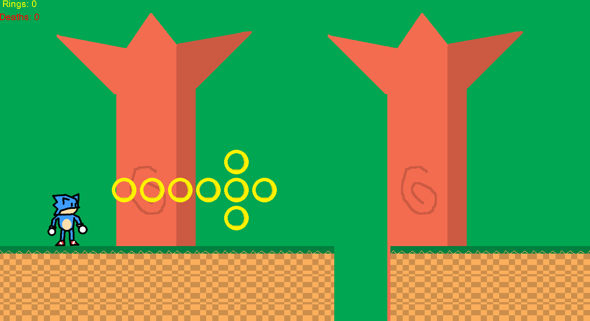
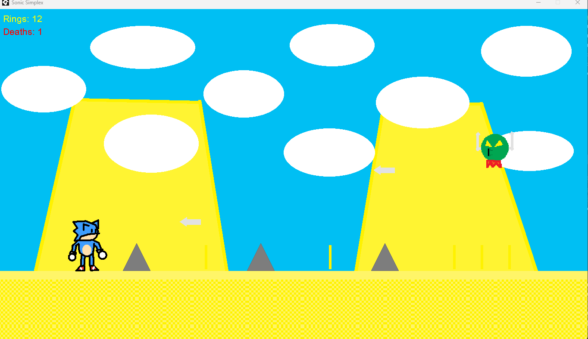

NOTE FROM 22/05/2026: Hello, there folks. If you want to clone this repository, please, do not select main because I have to update it and lol... IT'S SO FUCKING FRUSTRAITING. Select v1.0-Beta1. Thank you for a moment, and enjoy as I did it while making this thing...

# Sonic Simplex

In a parallel universe, from the universe of the Sonic we all know (BadF)...  
A Sonic without cornea embarks on the adventure of his life!

---

# STORY

One day, Sonic was resting peacefully in his house (yes, in this universe, Sonic has an actual house). When suddenly, Dr. Robotnik appeared.

> "Well, little scrapped-fished rodent! I'm going to conquer the universe! Starting by... KILLING YOU AND YOUR RODENT HOUSE!"
> yelled Eggman with despair.

Then Eggman threw a bomb into his house. Sonic didn't survive...  
Or that was what the evil doctor thought about the situation...

Sonic, angry about what happened, instantly had in his mind a new destination:

**Eggman's fortress.**

And that's how our adventure starts...

---

# GAMEPLAY

The gameplay is simple.

The player (Sonic) has to pass series of obstacles.  
Each act has 12 rooms.

It's like SRB1 (but it sucks less, I guess...)

---

# LEVELS

## Woodland Forest
Wood Zone (scrapped idea from Sonic 2 and SRB2) but better!

## Dusty Range
What if we mix Dusty Shower (from Sonic 2) and Rocky Mountain (from the SRB saga)?  
This zone is the answer.

## Ice Base
Somehow, this place is a reflection from the "Earless" universe.  
It's Knothole Base, but cold XD.

## Mine Maze
Oh hell no...

The worst zone from all of the SRB2 Demo Era returns...

Try, if you bother, to pass this zone...

## Dark City
Genocide City but less aggressive.

## Robotnirock
Death Egg, but Eggman is less stupid building this. LOL.

## Final Boss
With the power of the 3 gods from the clock...

Only with these, the true power...

You can finally confront Dr. Robotnik **ON THE MOON!**

Yeah folks...

**SHITPOSTER'S DREAM HAS FINALLY ARRIVED AND HE'S PISSING ON THE MOON!!**

(Nah, just kidding.)

---

# EX LEVELS

WIP (Work In Progress)

---

# NOTE

This fangame is **NOT A MASTERPIECE**.  
And don't take it too seriously.

This is how a successor of SRB1 would be like.

My intention is to make it as 90's as possible.

---

# BYE!!!!
